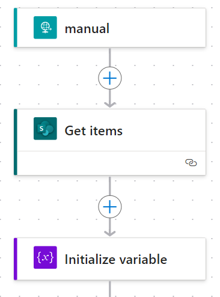
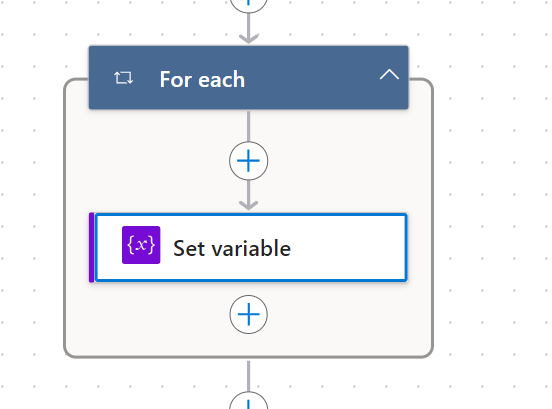
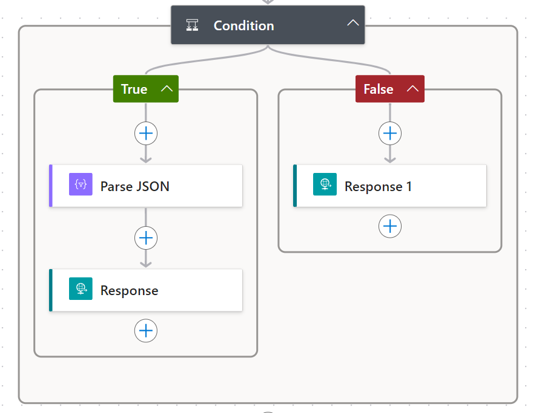
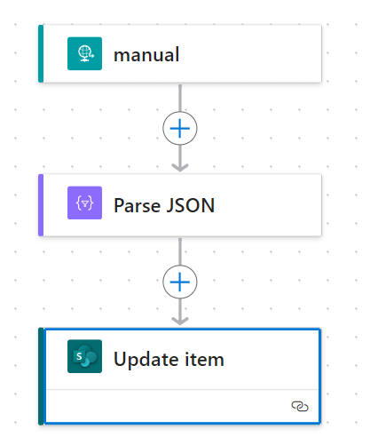
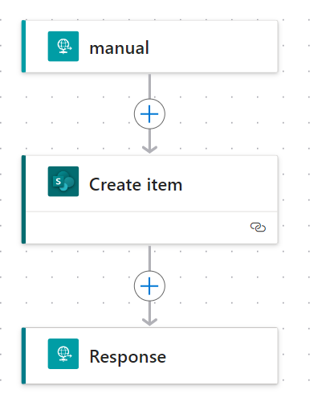
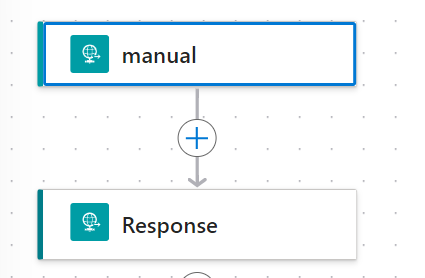
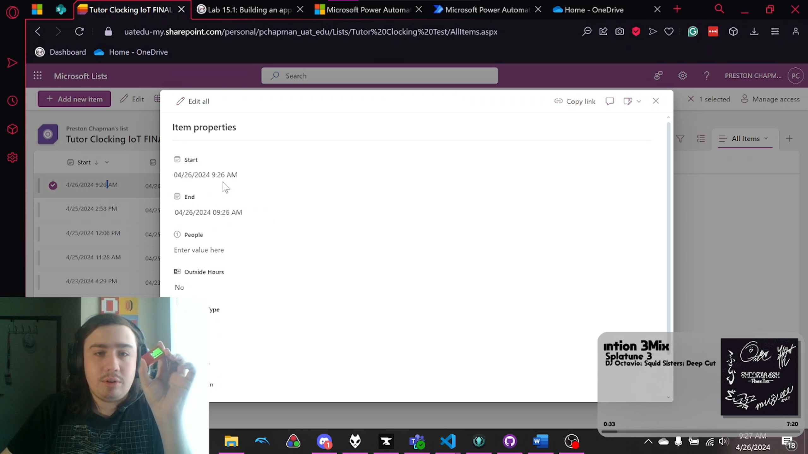

# Final: Building an application (Lab 15.1)

**CSC230 | UAT**

**4/26/2024**

**Preston Chapman**

# Table of Contents
<details>
<summary>
    Click to View the TOC
</summary>

[Table of Contents](#_Toc165016610)

[Overview](#overview)

[Resources](#resources)

[Bill of Materials](#bill-of-materials)

[M5StickC Plus Resources](#m5stickc-plus-resources)

[Clocking Manager](#clocking-manager)

[Overview](#overview-1)

[Power Automate](#power-automate)

[Get Active Session](#get-active-session)

[Clock Out](#clock-out)

[Clock In](#clock-in)

[Get Time](#get-time)

[Microsoft Lists](#microsoft-lists)

[Image](#image)

[M5StickC Plus](#m5stickc-plus)

[Features](#features)

[Display](#display)

[Library](#library)

[Functions](#functions)

[Code](#code)

[Demonstration](#demonstration)

[Video](#video)

[Code](#_Toc165016632)
</details>

# Overview

In this project we were tasked with creating an application of our choice for the M5StickC plus, I decided to create a clocking application that will track when I clock in and out of tutoring.

# Resources

## Bill of Materials

-   Arduino IDE recommended (VS Code was used)
-   ESP32 Boards manager
-   M5Stick C Plus
    -   M5Stick C Plus
    -   USB-A To USB-C Data and Power
    -   2 Braces (optional)
    -   1 Strap (Optional)
-   Computer or Laptop (Windows was used)
-   M5StickCPlus library
-   Microsoft 365 Subscription
    -   Microsoft Lists
    -   Microsoft power automate

## M5StickC Plus Resources
<details>
<summary>
    Click to view resources
</summary>

ESP32 240MHz dual core, 600 DMIPS, 520KB SRAM, WiFi

Flash Memory 4MB

Power Input 5V @ 500mA

Port TypeC x 1, GROVE(I2C+I/0+UART) x 1

LCD screen 1.14 inch, 135\*240 Colorful TFT LCD, ST7789v2

Button Custom button x 2

LED RED LED

MEMS MPU6886

Buzzer built-in buzzer

IR Infrared transmission

MIC SPM1423

RTC BM8563

PMU AXP192

Battery 120 mAh @ 3.7V

Antenna 2.4G 3D Antenna

PIN port G0, G25/G36, G26, G32, G33

Operating Temperature 0°C to 60°C

Net weight 15g

Gross weight 21g

Product Size 48.2\*25.5\*13.7mm

Package Size 65\*25\*15mm

Case Material Plastic ( PC )

</details>

# Clocking Manager

## Overview

This application uses Microsoft power automate to communicate with Microsoft lists. This is done using the HTTP post method, and Power Automate will respond with the necessary information depending on the request.

## Power Automate

### Get Active Session

Using the generated URL from power automate Arduino will send a post request, once received it will get all items from the Microsoft SharePoint list, it will then initialize a variable to store the current session.



When receiving the items from Microsoft lists a filter is added using the following formula `Start ge 'utcNow('yyyy-MM-dd')`
This will get all entries that are greater than or equal to the current date.

After doing so it will then go through all items in the list, saving the last one to the variable.



Once all items have been cycled through it will then check if the variable is empty using this condition: `empty(variables('currentSession'))` is not equal to `true`

Meaning if there is a session it will run the true side of the condition.

Once true it will convert the data from the variable to a JSON string, this is done automatically using a Schema provided automatically by Microsoft lists. It will then send a response of that JSON.

If no sessions are found it will then respond with “No active session” as the body.



### Clock Out

When clocking out Microsoft lists expects a response with a JSON body schema of the following: 
```json
{
    "id": "int",
    "clockOutTime": "string",
    "people": "int"
}
```

After receiving the response, it will convert it to a JSON object variable, and then update the item based on the id received.



All values will remain the same excluding the end, which will be changed using the UTC now function.

### Clock In

When ran clock in will create a new item in the SharePoint list using the UTC now function, after creating the item it will then return the ID of the item that was created.



### Get Time

Getting time is simple and will only return the UTC now time from power automate as the body of the response.



## Microsoft Lists

Microsoft lists is a tabular format database that can be accessed on the web and can be easily integrated with excel and other applications. The list will store the following information: Outside hours (Bool), Start (UTC Date/Time) End (UTC Date/Time), People (Number)\*, Rate (Currency)\*, Worked Hours and Minutes (Calculated Number), and Earnings (Calculated Currency). Rate is auto populated for a set amount; however, it can be changed as needed. People is currently an unused column and will be used later to track the number of students assisted.

### Image


## M5StickC Plus

### Features

When pressing the side button (button B), it will change its current mode, displayed on the second line, GET will get the current active session, CLOCK OUT will clock out if the is a loaded session, and CLOCK IN will clock in for a new session.

### Display

This display will show the current mode, clocked in time, ID of loaded session, and the current time.


### Library

Multiple libraries where used for this project; “[WiFi](https://raw.githubusercontent.com/espressif/arduino-esp32/gh-pages/package_esp32_index.json)” for ESP32 is used for internet connections, "[HTTPClient](https://raw.githubusercontent.com/espressif/arduino-esp32/gh-pages/package_esp32_index.json)" for ESP32 is used to connect as a client for websites from URL’s “[M5StickCPlus](https://github.com/m5stack/M5StickC-Plus/tree/master)” is used for the display and real time clock (RTC), and “[ArduinoJson](https://github.com/bblanchon/ArduinoJson)” is used for parsing the HTTP response.

### Functions

#### httpGETString
```cpp
String httpGETString(String HTTP_URL, String Header1 = "", String Header2 ="",String body = "")
```
This will require a HTTP URL string, as well as optionally have a Header1, Header2, and Body.

This will connect using the HTTP URL adding the header if needed, and they will post using the client, after posting it will post the response code and body/error to the serial, while then returning the body.

#### httpSendJson
```cpp
String httpSendJson(String HTTP_URL)
```
This will require a HTTP URL string and will create the body using the global ID variable, it will then run the htttpGETString function using the HTTP URL and a Header1 of “Content-Type” and Header2 of “application/json” and sending the body content. This will return the response as a String

#### httpGETJSON
```cpp
JsonObject& httpGETJSON(String HTTP_URL)
```
This will require an HTTP URL and return a json object by running httpGETString and parsing it with the json buffer object.

#### formatTime
```cpp
String formatTime(String time)
```
This requires a string for a UTC time with the format of `2024-04-25T19:08:27Z`, it will then convert it to the format of 12:08 PM, as well as adjusting it to the correct time zone.
#### setRTC
```cpp
void setRTC(String payload)
```
This requires a string for a UTC time with the format of `2024-04-25T20:41:37.1771909Z`, it will then set the RTC data time using that string.

### Code

To view the code please visit the GitHub in [Demonstration](#code-1)

# Demonstration

## Video



View video on [OneDrive](https://uatedu-my.sharepoint.com/:v:/r/personal/pchapman82070_uat_edu/Documents/CSC230%20PC_Final.mkv?csf=1&web=1&e=w6TNeH&nav=eyJyZWZlcnJhbEluZm8iOnsicmVmZXJyYWxBcHAiOiJTdHJlYW1XZWJBcHAiLCJyZWZlcnJhbFZpZXciOiJTaGFyZURpYWxvZy1MaW5rIiwicmVmZXJyYWxBcHBQbGF0Zm9ybSI6IldlYiIsInJlZmVycmFsTW9kZSI6InZpZXcifX0%3D)

## Code

The full project code can be viewed on the [GitHub](https://github.com/pchapman-uat/CSC230-Final)
